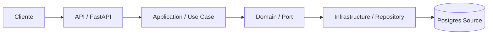

Source API

**Arquitetura**
Este modulo segue Clean Architecture com camadas separadas e dependencia fluindo de fora para dentro.
O `main.py` e o composition root.

**Camadas**
- `api/` entrega HTTP com FastAPI, schemas, parsers, serializers e handlers.
- `application/` casos de uso, validacoes e contratos de entrada.
- `domain/` entidades e portas (interfaces) do dominio.
- `infrastructure/` adaptadores externos como SQLAlchemy e settings.

**Fluxo De Requisicao**
1. Request HTTP entra em `api/routes.py`.
2. Parser normaliza sinais e schemas montam o `DataQuery`.
3. Use case valida e consulta o repositorio via porta.
4. Repositorio SQLAlchemy acessa o Postgres fonte.
5. Serializer formata a resposta JSON.

**Diagrama**

**Responsabilidades**
- `main.py` configura dependencias, lifecycle e registra rotas.
- `api/dependencies.py` faz o wiring entre camadas.
- `application/validators.py` garante regras de negocio.
- `domain/ports.py` define o contrato esperado pelo use case.
- `infrastructure/repository.py` implementa acesso ao banco.
